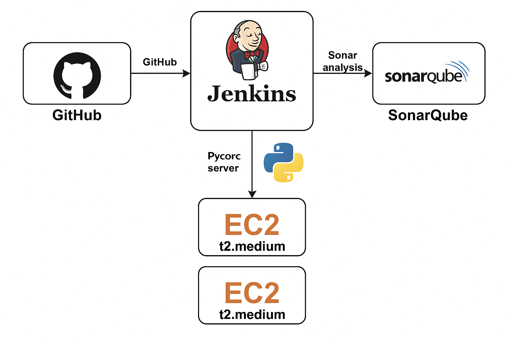
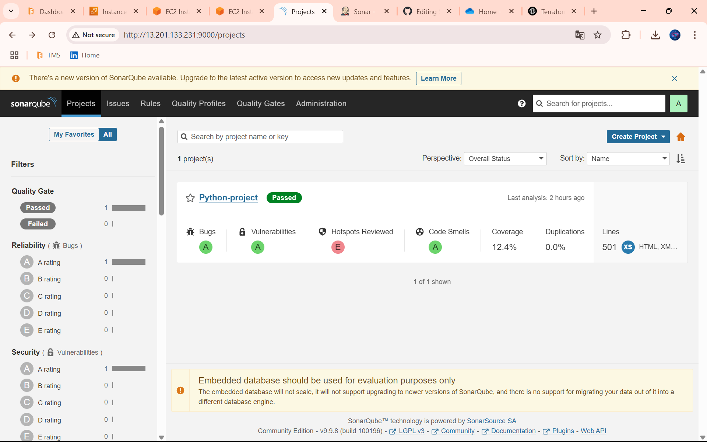
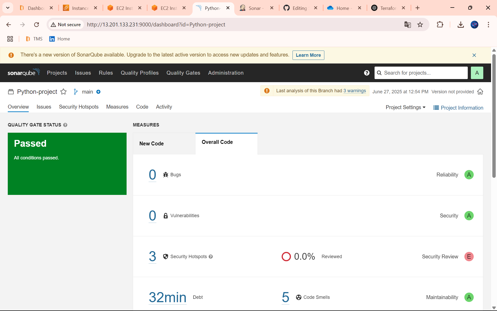

# Python CI Pipeline with Jenkins and SonarQube on AWS



# SonarQube + Jenkins CI/CD Pipeline Setup on AWS EC2

This guide sets up a complete CI pipeline with Jenkins and SonarQube for Python code analysis.

---

## 🖥️ EC2 Instances Required

| Instance     | Type      | Purpose     |
|--------------|-----------|-------------|
| SonarQube    | t2.medium | Code analysis |
| Jenkins      | t2.medium | CI automation |

---

## 🔧 SonarQube Setup (EC2 Instance)

```bash
sudo su
```
```bash
apt update -y
```
```bash
apt install docker.io -y
```
```bash
usermod -aG docker $USER
```
```bash
docker run -d --name sonarqube \
  -p 9000:9000 \
  sonarqube:lts-community
```

**Then access: `http://<SonarQube_Public_IP>:9000`**

---

## 🔧 Jenkins Setup (EC2 Instance)

```bash
sudo su
```
```bash
apt update -y
```
```bash
nano Jenkins.sh
```

Paste the script:

```bash
#!/bin/bash
 
# Exit immediately if a command exits with a non-zero status
set -e
 
echo "Installing Java (OpenJDK 17)..."
sudo apt update
sudo apt install openjdk-17-jdk -y
 
echo "Adding Jenkins repository key..."
curl -fsSL https://pkg.jenkins.io/debian-stable/jenkins.io-2023.key | sudo tee /usr/share/keyrings/jenkins-keyring.asc > /dev/null
 
echo "Adding Jenkins package repository..."
echo "deb [signed-by=/usr/share/keyrings/jenkins-keyring.asc] https://pkg.jenkins.io/debian-stable binary/" | sudo tee /etc/apt/sources.list.d/jenkins.list > /dev/null
 
echo "Updating package list..."
sudo apt update
 
echo "Installing Jenkins..."
sudo apt install jenkins -y
 
echo "Starting Jenkins service..."
sudo systemctl start jenkins
 
echo "Enabling Jenkins to start on boot..."
sudo systemctl enable jenkins
 
echo "Jenkins installation complete!"
echo "Access Jenkins at: http://<your_server_ip>:8080"
echo "To get the initial admin password, run: sudo cat /var/lib/jenkins/secrets/initialAdminPassword"
```

Make executable and run:

```bash
chmod +x Jenkins.sh
```
```bash
./Jenkins.sh
```

Install Python environment:

```bash
sudo apt install python3.12-venv -y
```
```bash
python3 -m venv myenv
```
```bash
source myenv/bin/activate
```
```bash
sudo apt install python3-pip -y
```
**Then access: `http://<Jenkins_Public_IP>:8080`**

---

## 🔌 Jenkins Plugin Configuration

1. **Install Plugins:**
   - Pipeline: Stage View
   - SonarQube Scanner

2. **Configure SonarQube in Jenkins:**
   - Go to **Manage Jenkins > System > SonarQube Servers**
   - Add:
     - Name: `sonar-server`
     - Server URL: `http://<SonarQube_Public_IP>:9000`
     - Add credentials:
       - Kind: Secret text
       - Secret: `<SonarQube token>`
       - ID: `sonar-server`
       - Description: `sonar-server`

3. **Configure Sonar Scanner Tool:**
   - Go to **Manage Jenkins > Tools > SonarQube Scanner installations**
   - Name: `sonar-scanner`

---

## 📦 Generate Token from SonarQube

- Go to **Administration > Security > Users**
- Click `...` > Generate Token > Copy > In Secret Text

---

## 🧪 Jenkins Job Configuration

1. Click `New Item`
2. Job Name: Your choice
3. Select: `Pipeline`
4. Discard old builds: Max builds = 2 (Optional)

**Paste the following script in Pipeline section:**

```groovy
pipeline {
    agent any

    environment {
        SCANNER_HOME = tool 'sonar-scanner'
    }

    stages {

        stage('Git Checkout') {
            steps {
                git branch: 'master', url: '<Your GitHub Repo>'
            }
        }

        stage('Setup Virtual Environment') {
            steps {
                sh '''#!/bin/bash
                set -e
                rm -rf venv
                python3 -m venv venv
                chmod -R 755 venv
                source venv/bin/activate
                python -m pip install --upgrade pip
                pip install -r requirements.txt
                '''
            }
        }

        stage('Test') {
            steps {
                sh '''#!/bin/bash
                set -e
                source venv/bin/activate
                pytest --cov=app --cov-report=xml
                pytest --cov=app --cov-report=term-missing --disable-warnings
                '''
            }
        }

        stage('Sonar') {
            steps {
                withSonarQubeEnv('sonar-server') {
                    sh '''#!/bin/bash
                    set -e
                    export SONAR_SCANNER_OPTS="-Xmx1024m"
                    $SCANNER_HOME/bin/sonar-scanner \
                        -Dsonar.projectKey=Python-project \
                        -Dsonar.projectName=Python-project \
                        -Dsonar.sources=. \
                        -Dsonar.exclusions=venv/** \
                        -Dsonar.python.coverage.reportPaths=coverage.xml \
                        -Dsonar.sourceEncoding=UTF-8
                    '''
                }
            }
        }
    }
}
```

Click **Save** then **Build Now**

---

## 🔍 Check SonarQube Dashboard

Visit `http://<SonarQube_Public_IP>:9000` to see analysis results.

---

---
# Outputs




---

## 👨‍💻 Author

**Meet01234** – DevOps | Terraform | Jenkins | SonarQube
